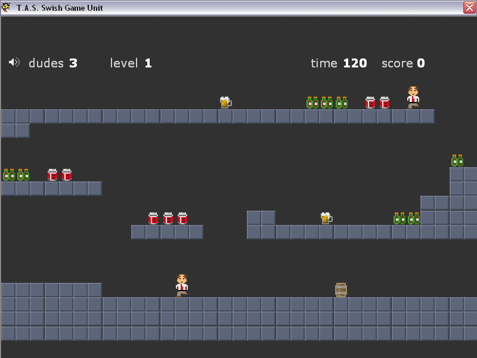



## A Beer For The Boys

### Description

An example of minimal code to get the job done.LOL Beer Dude 2 belongs to its creator. I was just sucking some sudds & thought I would share this fun. Enjoy !
 
### More Info
 

             |
---                |---
**Submitted On**   |2004-08-11 02:51:54
**By**             |[Thomas Swift](https://github.com/Planet-Source-Code/PSCIndex/blob/master/ByAuthor/thomas-swift.md)
**Level**          |Beginner
**User Rating**    |5.0 (30 globes from 6 users)
**Compatibility**  |VB 6\.0
**Category**       |[Games](https://github.com/Planet-Source-Code/PSCIndex/blob/master/ByCategory/games__1-38.md)
**World**          |[Visual Basic](https://github.com/Planet-Source-Code/PSCIndex/blob/master/ByWorld/visual-basic.md)
**Archive File**   |[A\_Beer\_For1780668112004\.zip](https://github.com/Planet-Source-Code/thomas-swift-a-beer-for-the-boys__1-55502/archive/master.zip)

